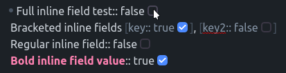

# Better Inline Fields
Simple Obsidian plugin that aims to improve work with [Dataview inline fields](https://blacksmithgu.github.io/obsidian-dataview/data-annotation/) (like `Some Field:: value`).

## Features
- [x] Add checkbox that allows toggling of inline boolean values

- [ ] Add autocomplete to field values based on same name field in other files.
